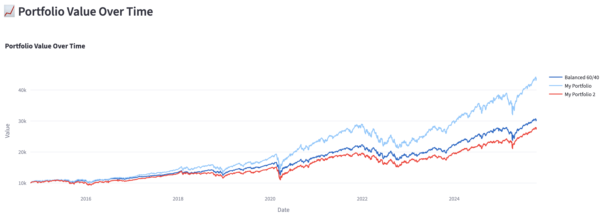

# Student Portfolio Playground

Welcome to **Student Portfolio Playground**! 🎓💹  

This is a personal side project developed by a university student to experiment with **portfolio building, optimization, and financial data visualization**.  
It’s designed as a learning playground where you can explore how different portfolio strategies perform — all inside an interactive web app.

Check it out here 👉 [Student Portfolio Playground](https://codingluisng-investment-portfolio-backtester.streamlit.app)

---

## 🚀 Features

### 🧮 Build Your Own Portfolio
- Add / remove tickers and assign weights easily.
- Validate that weights sum to 100%.
- Edit or delete portfolios anytime.


### 📊 Compare Portfolios
  - Select multiple portfolios to backtest over a custom date range.
  - Calculate and display metrics:
    - Total & Annualized Return 
    - Sharpe & Sortino Ratios
    - Max Drawdown
    - Average Volatility
  
  - Visualize:
    - Portfolio growth over time
    
    - Asset allocation pie charts
    
    - Risk vs Return scatter plot
    
    - Correlation heatmaps
    


---

### ⚙️ Optimize Portfolios
Take your portfolio to the next level with **smart optimization**!  
Choose an objective and let the system search for the best possible combination of assets.

**Available optimization objectives:**
- **Sharpe Ratio** – maximize risk-adjusted return  
- **Sortino Ratio** – focus on downside protection  
- **Calmar Ratio** – balance return vs. drawdown  
- **Minimum Volatility** – lowest possible risk  
- **Annualized Return** – pure performance chasing  
- **Beta** – target market sensitivity  
- **Diversification Score** – maximize cross-asset independence  

Each optimization run generates **thousands of random portfolios**, evaluates them, and visualizes the results using interactive **Plotly** scatter charts.


---

### 🧠 Information Page
A friendly educational section that helps users understand key financial metrics — perfect for beginners.

**Currently Explained:**
- **Sharpe Ratio** – Return per unit of total risk  
- **Sortino Ratio** – Return per unit of downside risk  
- **Calmar Ratio** – Return relative to drawdowns  
- **Beta** – Sensitivity to market movements  
- **Diversification Score** – How independent your portfolio assets are

---

## How to Use

1. Go to the [web app](https://codingluisng-investment-portfolio-backtester.streamlit.app).
2. Click **Build Portfolio** to create or edit portfolios:
   - Enter a portfolio name.
   - Add tickers and assign weights.
   - Click **Save Portfolio** when ready.
3. View all saved portfolios below the input form.
4. To compare portfolios, switch to the **Compare Portfolios** tab:
   - Select portfolios you want to analyze.
   - Pick a start and end date.
   - Click **Run Backtest** to see charts and metrics.
5. Go to **Optimize Portfolio** to find the best weight allocation.
6. Explore the **Information Page** to understand metrics and financial concepts.

---

## Tech Stack

- **Python 3.11**
- **Streamlit** — fast, interactive web interface
- **Plotly** — for all visualizations and analytics charts
- **Pandas & NumPy** — portfolio math and simulation
- **yfinance** – fetch historical price data

---

## How to Run Locally

1. Clone the repo:
   ```bash
   git clone https://github.com/CodingLuisNg/student-portfolio-playground.git
   cd student-portfolio-playground
   ```
2. Install dependencies:
   ```bash
   pip install -r requirements.txt
   ```
3. Run the app:
   ```bash
   streamlit run main.py
   ```

---

## Notes

- This is a **student project**, built mostly for learning and experimentation.
- It’s **not financial advice**—just a sandbox to play around with portfolio data.
- Some features are still in progress:
  - Time-based strategies
  - Enhanced portfolio analytics
  - Better UI tweaks and responsiveness

---

Made with ❤️ by Luis Ng, a CS student trying to combine coding and finance into a fun side project.

---

## License
This project is licensed under the [MIT License](LICENSE).