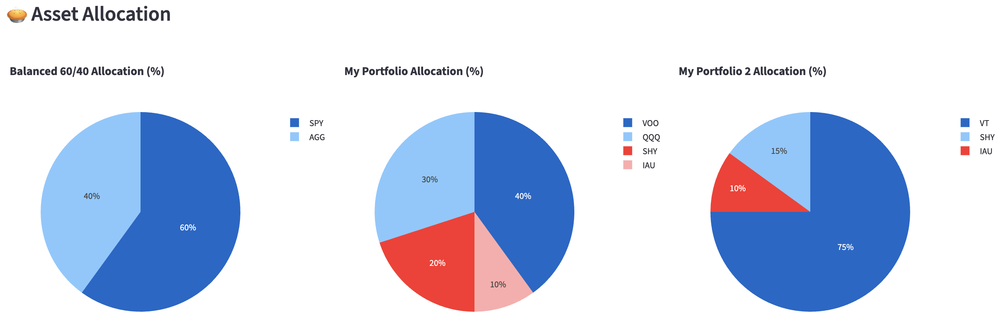

# Student Portfolio Playground

Welcome to **Student Portfolio Playground**! 🎓💹  

This is a personal side project developed by a university student to experiment with building, managing, and analyzing investment portfolios. It’s designed as a fun playground for learning about portfolio management, backtesting, and visualizing financial data—all in one interactive web app.

Check it out here: [Student Portfolio Playground](https://codingluisng-investment-portfolio-backtester.streamlit.app)

---

## Features

**Build your own portfolio**
  - Add tickers and assign weights.
  - Remove or edit assets easily.
  - Validate weights sum to 100%.
  - Delete saved portfolios with a single click.


**Compare portfolios**
  - Select multiple portfolios to backtest over a custom date range.
  - Calculate and display metrics:
    - Total Return
    - Annualized Return
    - Sharpe & Sortino Ratios
    - Max Drawdown
    - Average Volatility
  
  - Visualize:
    - Portfolio growth over time
    
    - Asset allocation pie charts
    
    - Risk vs Return scatter plot
    
    - Correlation heatmaps
    

**Interactive and visual**
  - Fully built with **Streamlit** for a smooth, interactive web experience.
  - Charts powered by **Plotly** for dynamic exploration.

---

## How to Use

1. Go to the [web app](https://codingluisng-investment-portfolio-backtester.streamlit.app).
2. Click **Build Portfolio** to create or edit portfolios:
   - Enter a portfolio name.
   - Add tickers and assign weights.
   - Click **Save Portfolio** when ready.
3. View all saved portfolios below the input form.
4. To compare portfolios, switch to the **Compare Portfolios** tab:
   - Select portfolios you want to analyze.
   - Pick a start and end date.
   - Click **Run Backtest** to see charts and metrics.

---

## Tech Stack

- **Python 3.11**
- **Streamlit** – web app interface
- **Plotly** – interactive charts and graphs
- **Pandas & NumPy** – data processing
- **yfinance** – fetch historical price data

---

## Notes

- This is a **student project**, built mostly for learning and experimentation.
- It’s **not financial advice**—just a sandbox to play around with portfolio data.
- Some features are still in progress:
  - Time-based strategies
  - Enhanced portfolio analytics
  - Better UI tweaks and responsiveness

---

## How to Run Locally

1. Clone the repo:
   ```bash
   git clone https://github.com/CodingLuisNg/student-portfolio-playground.git
   cd student-portfolio-playground
   ```
2. Install dependencies:
   ```bash
   pip install -r requirements.txt
   ```
3. Run the app:
   ```bash
   streamlit run main.py
   ```
   
---

Made with ❤️ by Luis Ng, a CS student trying to combine coding and finance into a fun side project.

---

## License
This project is licensed under the [MIT License](LICENSE).